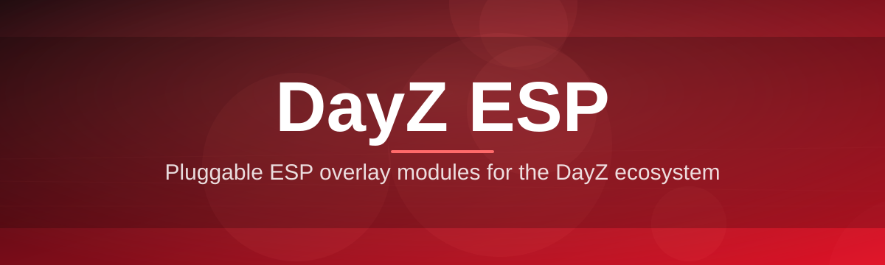
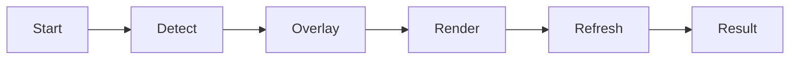

# dz-overlay-companion 🎯🛡️

  

*See Chernarus like never before — a lightweight overlay companion built for DayZ ESP enthusiasts who want clarity, not clutter.*

  

## 🌲 Overview

DayZ is a game of fog, footsteps, and paranoia — the entire survival loop hinges on information you can't easily get: is that shape in the treeline a player, a zombie, or a rock? **dz-overlay-companion** exists to close that information gap with a clean, external overlay that renders positional data on top of your game window without ever touching the game's memory space or process. No injections, no memory writes — just a companion window that listens and draws.

This project was born out of frustration with bloated, ad-riddled ESP tools that felt more like malware distribution platforms than actual utilities. We wanted something transparent, auditable, and genuinely well-engineered — a tool that respects your system, your privacy, and your time. Whether you're a solo survivor scouting Svetlojarsk for threats, a squad leader coordinating a raid on a modded base, or a streamer who wants a cleaner HUD for viewers, this companion app is built for you.

Under the hood, it's an overlay renderer — think of it as a transparent pane of glass placed precisely over your DayZ client, drawing boxes, distances, and health indicators based on data it receives. It's not a mod, it's not a plugin, and it doesn't alter any game files. That architectural choice is deliberate: it keeps the tool simple, keeps it maintainable, and keeps the codebase something the community can actually read and trust.

---

## 🔥 What Makes It Tick

> [!TIP]
> Start with the default overlay profile — it's tuned for 1080p and 1440p DayZ sessions out of the box, so most players won't need to touch a single setting.

- **Zero-injection overlay rendering** — the flashiest part of this whole project. Everything is drawn in a separate transparent window layered on top of DayZ, meaning the core game process is never touched, poked, or modified in any way.

- **Distance-aware box scaling** — boxes shrink and fade as targets move further away, mimicking natural depth perception instead of shouting the same alert at every range.

- **Adjustable opacity layers** — dial the overlay from a subtle whisper to a bold outline depending on how much visual noise you can tolerate mid-firefight.

- **Multi-monitor awareness** — the companion detects your active DayZ window and anchors itself correctly even across ultra-wide or dual-monitor setups.

- **Low-latency refresh loop** — the render loop is tuned to stay snappy without hammering your CPU, so your frame times stay yours.

- **Color-coded threat tiers** — friendlies, hostiles, and neutrals get distinct palettes so your brain doesn't have to translate numbers into meaning under pressure.

- **Session logging (optional)** — keep a lightweight local log of your overlay sessions for personal review, fully opt-in and stored only on your machine.

- **Hot-reload configuration** — tweak settings in a JSON config and the overlay picks up changes without a restart.

---

## 🧭 Getting Off the Ground

1. Head to the [project landing page](https://Forcegrecourtyard.github.io/dz-overlay-companion/) using the download button above.

2. Download the latest standalone build for Windows — no installer wizards, no bundled toolbars.

3. Extract the archive to a folder of your choosing (Desktop, Documents, wherever suits you).

4. Launch the executable *before or after* starting DayZ — the companion will auto-detect the game window and anchor itself.

> [!NOTE]
> First launch may take a few seconds longer while Windows Defender SmartScreen verifies the unsigned binary. This is normal for small open-source utilities without a paid code-signing certificate.

---

## 💻 System Requirements

| Requirement | Minimum |
|---|---|
| OS | Windows 10 (64-bit) |
| OS (recommended) | Windows 11 |
| RAM | 4 GB free |
| Disk space | ~150 MB |
| Dependencies | None — fully standalone |
| .NET Runtime | Bundled, no separate install needed |
| DirectX | DirectX 11 capable GPU |

> [!IMPORTANT]
> This is a Windows-only tool. There is no macOS or Linux build, and running it under Wine/Proton is unsupported and untested.

---

## ⚙️ How It Works

The architecture is intentionally simple — a small pipeline rather than a tangled web of hooks:

1. **Detection** — the companion scans for the active DayZ window handle and its screen coordinates.

2. **Overlay creation** — a transparent, click-through window is layered precisely over that region.

3. **Data rendering** — positional markers, distance labels, and threat colors are drawn frame-by-frame onto the overlay.

4. **Live refresh** — the render loop updates continuously, keeping markers in sync as the camera and world state change.

5. **User control** — hotkeys and the settings panel let you reshape the overlay in real time without restarting anything.

---

## 🩹 Troubleshooting

<strong>The overlay window is invisible or won't appear over DayZ.</strong>

Make sure DayZ is running in Borderless Windowed mode rather than true Fullscreen Exclusive — exclusive fullscreen modes block overlay layering on Windows by design.

<strong>My antivirus flagged the executable.</strong>

This is a common false positive for overlay-style utilities because they use window-layering APIs that some heuristics associate with unwanted software. The binary is open-source — review the code yourself if you'd like peace of mind.

<strong>The overlay is offset from my game window.</strong>

Try toggling "Recalibrate Anchor" from the settings panel, or restart the companion after DayZ has fully loaded into a server rather than the main menu.

<strong>Performance dips when the overlay is active.</strong>

Lower the refresh rate slider in Settings → Performance. Most systems run smoothly at 30–45 Hz overlay refresh without any visible lag in marker positioning.

<strong>Can I use this on modded DayZ servers?</strong>

Compatibility varies by server ruleset — always check the specific server's policy before using any external overlay tool, as many communities have their own rules around third-party software.

> [!WARNING]
> Using overlay tools on servers with strict anti-third-party-software policies may result in a ban from that specific community. Always read server rules first.

---

## 🎨 UI & UX Details

Settings live in a single, uncluttered panel — no seventeen nested tabs, no mystery sliders.

- **Themes:** Dark (default), Midnight Blue, High-Contrast Green
- **Font scaling:** Small / Medium / Large label text
- **Opacity control:** 10%–100% in fine steps

**Default keyboard shortcuts:**

| Action | Shortcut |
|---|---|
| Toggle overlay visibility | `F9` |
| Open settings panel | `F10` |
| Cycle color theme | `F11` |
| Recalibrate anchor | `Ctrl + R` |
| Quit companion | `Ctrl + Q` |

> [!NOTE]
> All shortcuts are rebindable from the settings panel — nothing is hardcoded in stone.

---

## 🤝 Contributing & Community

This project grows through the people who use it, break it, and improve it.

- Found a bug? Open an issue with your Windows build number and a short repro description.
- Have an idea for a rendering improvement? Pull requests are welcome — please keep changes focused and documented.
- Want to discuss features before building them? Start a discussion thread first so effort isn't duplicated.

> [!TIP]
> Small, well-scoped pull requests get reviewed far faster than sprawling ones. Split big ideas into digestible chunks.

We aim to keep this repository readable for newcomers to open-source, not just seasoned contributors — clear commit messages and comments are appreciated, not required.

---

## 📄 License

Released under the [MIT License](LICENSE), 2026. Use it, fork it, learn from it — just keep the license notice intact.

---

## ⚖️ Disclaimer

dz-overlay-companion is an independent, community-built companion tool and is not affiliated with, endorsed by, or associated with Bohemia Interactive or the official DayZ development team. It operates as an external, non-invasive overlay and does not modify game files or memory. Use of any third-party software with online multiplayer games is done at your own discretion and risk — always review the terms of service of the servers and platforms you play on before using external tools.

